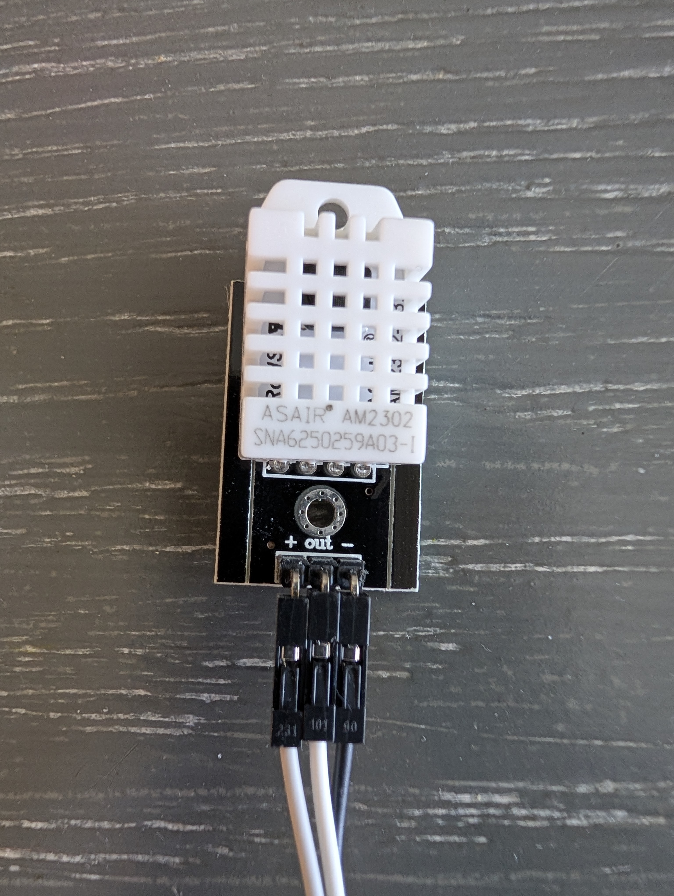
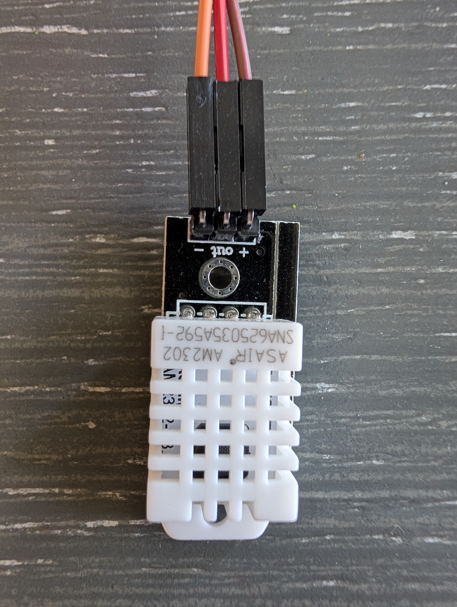
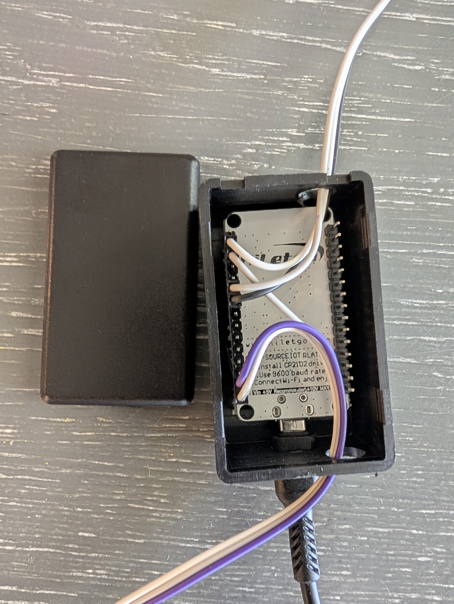

# Server Cabinet Temperature Monitor

<p align="center">
  
</p>

[](https://esphome.io)
[](LICENSE)
[](https://www.espressif.com)
[](https://www.home-assistant.io)

**ESPHome dual-sensor temperature & humidity monitor** for a 9U server cabinet.  
Tracks top vs bottom differential to detect hot spots, poor airflow, or fan failures early.

---

## ✨ Features

- Real-time Top + Bottom Temperature & Humidity
- Cabinet Average Temperature
- Temperature Delta (Top - Bottom)
- WiFi signal strength & uptime monitoring
- Fully local (no cloud services)
- Easy Home Assistant integration

---

## 🛠️ Hardware

See [`hardware/parts-list.md`](hardware/parts-list.md) for the complete bill of materials.

**Main Components:**
- ESP32 (or ESP8266)
- 2× HiLetgo DHT22 sensors (Top + Bottom)
- Jumper wires + optional 3D-printed enclosure

---

## 🚀 Quick Start

1. Copy the config from `esphome/server-cabinet-temp.yaml`
2. Update your WiFi & MQTT secrets
3. Flash to your ESP32/ESP8266
4. Import template sensors from `home-assistant/template-sensors.yaml`

```bash
# Optional: Using ESPHome CLI
esphome run esphome/server-cabinet-temp.yaml
```

---

## 📸 Project Photos


  
  
  
  ---
  
## 📖 Full Documentation

| Document                        | Description |
|--------------------------------|-------------|
| [`hardware/parts-list.md`](parts-list.md)             | Complete parts list + links |
| [`hardware/wiring.md`](wiring.md) | Wiring diagram and installation guide |
| [`esphome/server-cabinet-temp.yaml`](server-cabinet-temp.yaml) | Main ESPHome configuration |
| [`home-assistant/template-sensors.yaml`](template-sensors.yaml) | Home Assistant template sensors |

---

## ⚠️ Known Issues & Notes

- DHT22 sensors can give false high readings if placed too close to hot components
- Use 3.3V logic only — do not use 5V on data pins
- Add a 10kΩ pull-up resistor if readings are unstable

---

## 📝 Changelog

See recent commits (recently upgraded to ESP32).

---

## 🤝 Contributing

Contributions, issues, and feature requests are welcome!

---

## 📄 License

MIT License © 2026 Duc Nguyen

---

Star this repo if it helps you keep your servers cool! ❄️

Last updated: May 2026