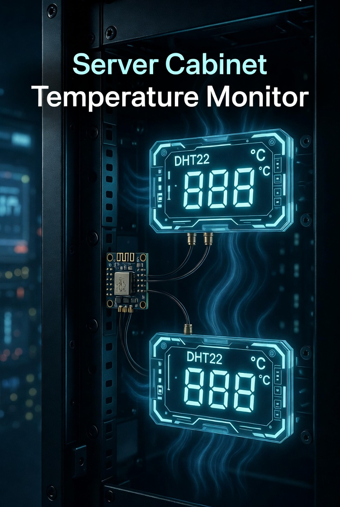

# Server Cabinet Temperature Monitor

ESPHome-based dual DHT22 temperature and humidity monitoring system for a **9U server cabinet** using an **ESP32**.

**Project Goal**: Monitor temperature differential between the top and bottom of the cabinet to detect hot spots, poor airflow, or fan failures early.

---

## Badges

---

## Features

- Real-time Top & Bottom Temperature + Humidity
- Average Cabinet Temperature
- Temperature Delta (Top - Bottom)
- WiFi Signal Strength & Uptime Monitoring
- Fully local control (no cloud)

---

## Hardware Used

See [`hardware/parts-list.md`](hardware/parts-list.md)

## Wiring & Installation

See [`hardware/wiring.md`](hardware/wiring.md)

## ESPHome Configuration

Full config: [`esphome/server-cabinet-temp.yaml`](esphome/server-cabinet-temp.yaml)

## Home Assistant Template Sensors

See: [`home-assistant/template-sensors.yaml`](home-assistant/template-sensors.yaml)

## How to Replicate This Project

1. Flash the ESP32 using ESPHome
2. Wire the two DHT22 sensors
3. Add the YAML files to Home Assistant
4. Mount securely inside the server cabinet

---

## Known Issues / Notes

- Use 3.3V logic on DHT22 data pins
- ESP32 provides better WiFi range and performance than ESP8266
- Consider adding a small 10kΩ pull-up resistor if readings are unstable

---

**Last Updated**: May 2026  
**Author**: Duc Nguyen  
**License**: MIT